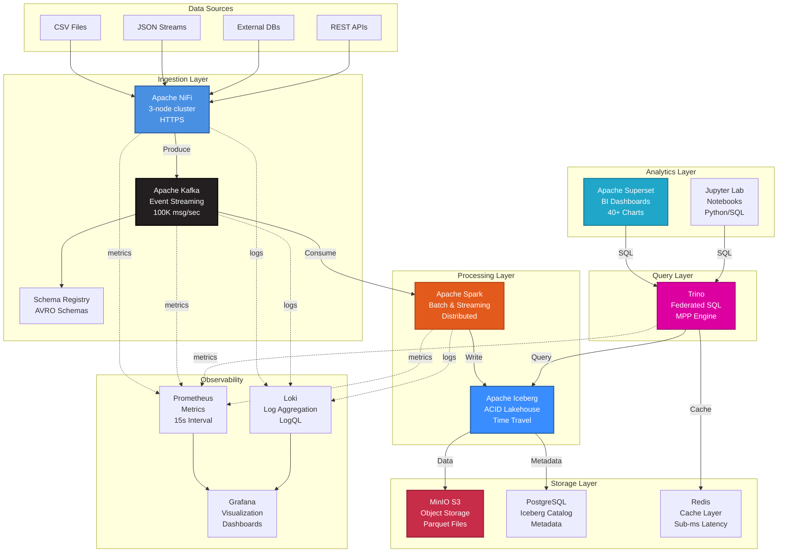
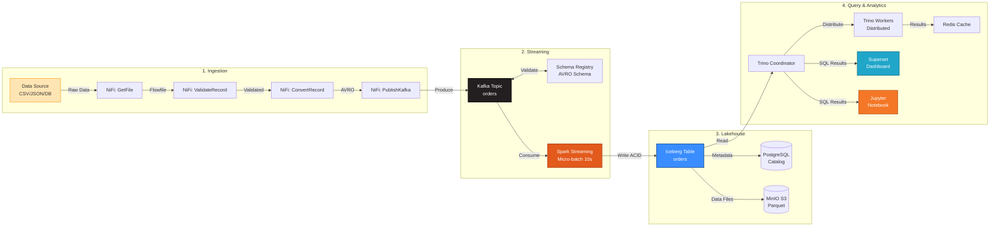
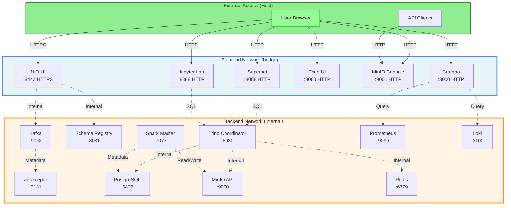
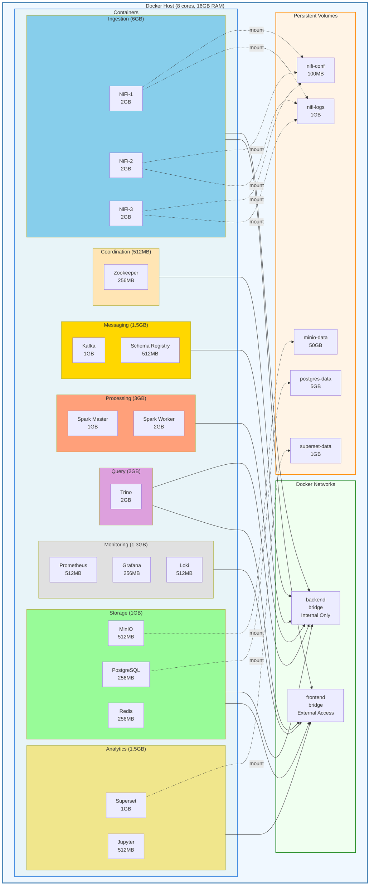
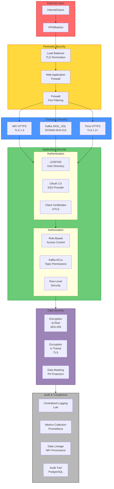
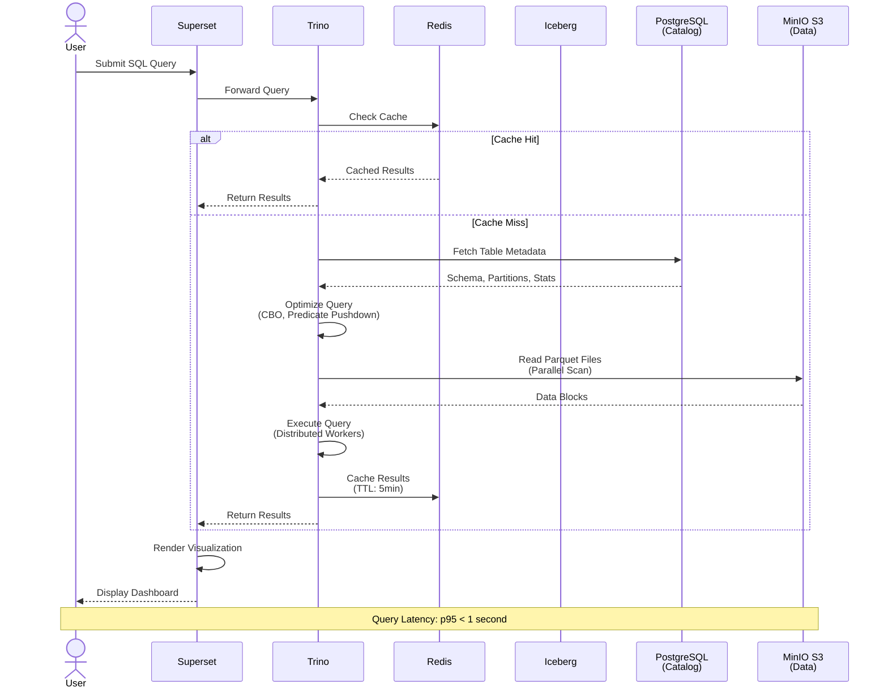
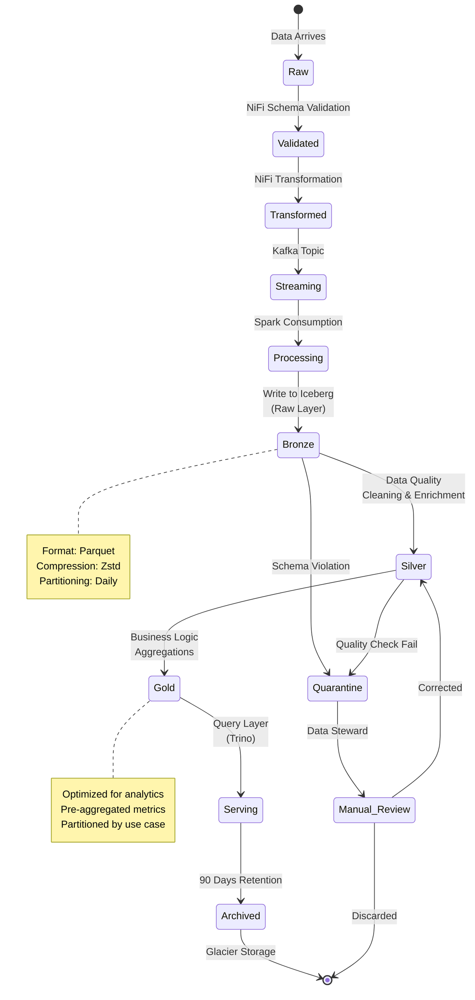
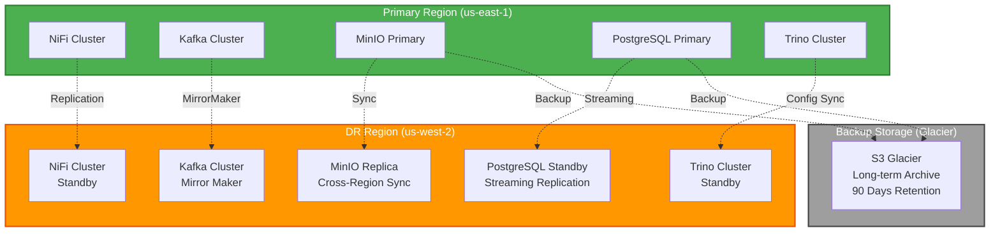
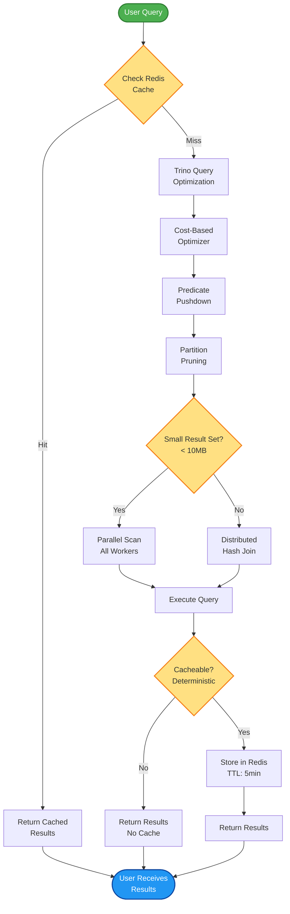

# Architecture Diagrams - Apache NiFi Data Lakehouse

This document contains Mermaid diagrams that render automatically on GitHub, providing interactive visual representations of the system architecture.

> **Note:** These diagrams complement the ASCII diagrams in [ARCHITECTURE.md](../ARCHITECTURE.md)

---

## Table of Contents

1. [System Architecture Overview](#system-architecture-overview)
2. [Detailed Data Flow](#detailed-data-flow)
3. [Network Topology](#network-topology)
4. [Deployment Architecture](#deployment-architecture)
5. [Security Architecture](#security-architecture)
6. [Component Interactions](#component-interactions)

---

## System Architecture Overview

High-level view of all components and their relationships:

---

## Detailed Data Flow

End-to-end data pipeline from source to analytics:

---

## Network Topology

Network segmentation and service connectivity:

---

## Deployment Architecture

Docker container layout with resource allocation:

---

## Security Architecture

Security layers and controls:

---

## Component Interactions

Sequence diagram showing a typical query flow:

---

## Data Lifecycle

Data lifecycle from ingestion to archival:

---

## Scaling Strategy

Horizontal scaling architecture:

```mermaid
graph LR
    subgraph Current["Current Deployment (Demo)"]
        direction TB
        N1[NiFi: 1 node]
        K1[Kafka: 1 broker]
        T1[Trino: 1 coordinator<br/>+ 1 worker]
        S1[Spark: 1 worker]
    end

    subgraph Medium["Medium Scale (100K events/s)"]
        direction TB
        N2[NiFi: 3 nodes]
        K2[Kafka: 3 brokers<br/>+ 3 ZooKeepers]
        T2[Trino: 1 coordinator<br/>+ 4 workers]
        S2[Spark: 4 workers]
    end

    subgraph Large["Large Scale (1M events/s)"]
        direction TB
        N3[NiFi: 5 nodes<br/>+ Load Balancer]
        K3[Kafka: 5 brokers<br/>+ 5 ZooKeepers<br/>+ Kafka Streams]
        T3[Trino: 1 coordinator<br/>+ 10 workers<br/>+ Query Federation]
        S3[Spark: 10 workers<br/>+ Auto-scaling]
    end

    Current -->|Scale Up| Medium
    Medium -->|Scale Up| Large

    style Current fill:#FFE5B4,stroke:#FFB84D,stroke-width:2px
    style Medium fill:#87CEEB,stroke:#4682B4,stroke-width:2px
    style Large fill:#98FB98,stroke:#228B22,stroke-width:2px
```

---

## Disaster Recovery Architecture

Multi-region disaster recovery setup:

---

## Performance Optimization Flow

Query optimization and caching strategy:

---

## Additional Resources

- **Main Architecture Document:** [ARCHITECTURE.md](../ARCHITECTURE.md)
- **Architecture Decision Records:** [docs/adr/](./adr/)
- **Operations Runbook:** [docs/operations.md](./operations.md)
- **Network Security:** [docs/security.md](./security.md)

---

**Document Version:** 1.0
**Last Updated:** 2025-02-04
**Rendered Best On:** GitHub (Mermaid support)
